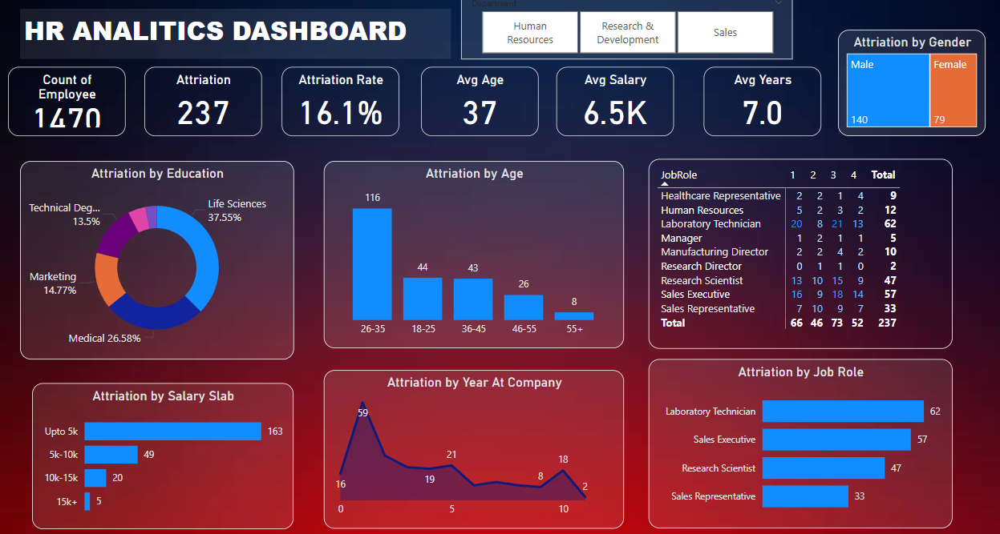

# 🚀 HR Data Analytics Dashboard

Welcome to the **HR Data Analytics Dashboard** project! This project uses data analytics and visualizations to gain valuable insights into key metrics such as **employee attrition**, **average salary**, **age distribution**, and more. The goal of this project is to help HR professionals make data-driven decisions to improve employee retention and optimize workforce management.

---
## 🖼️ Dashboard

**Dashboard:**  



## 📊 **Key Performance Indicators (KPIs)**

Here are the key metrics tracked and analyzed in this project:

- 📈 **Count of Employees**: The total number of employees in the company.
- 🔥 **Attrition**: The number of employees who left the company during a specified period.
- 💔 **Attrition Rate**: The percentage of employees who left the company relative to the total number of employees.
- 🧑‍🦳 **Average Age**: The average age of employees.
- 💸 **Average Salary**: The average salary of employees.
- 🕒 **Average Years at Company**: The average number of years employees have been with the company.

---

## 📊 **Charts & Visualizations**

This project includes the following visualizations to provide actionable insights from the HR data:

### 1. **Pie Chart: Attrition by Education 🎓**
Shows the distribution of employee attrition across various educational levels. This helps in understanding whether education level correlates with employee retention.

### 2. **Bar Chart: Attrition by Age 📅**
A bar chart depicting employee attrition across different age groups. This helps in analyzing which age group has the highest attrition.

### 3. **Table: Job Roles 💼**
Displays the number of employees by their job roles and their respective attrition rates. It highlights if certain roles have higher turnover rates.

### 4. **Cluster Bar Chart: Attrition by Salary Slab 💰**
A cluster bar chart that segments employee attrition by different salary slabs, helping HR to identify if salary influences attrition.

### 5. **Line Graph: Attrition by Years at Company 📆**
This line graph shows how employee attrition varies depending on how long employees have been with the company.

### 6. **Cluster Bar Chart: Attrition by Job Role 🧑‍💻**
Another cluster bar chart showing attrition rates across various job roles, helping HR understand which roles are more prone to high turnover.

### 7. **Tree Map: Attrition by Gender 👨‍🦱👩‍🦳**
A tree map visualizing attrition by gender, helping HR understand if there is any gender-based disparity in employee attrition.

### 8. **Slicer: HR, Research & Development, and Sales 🏢**
A slicer that allows HR to filter the data by different departments like **Human Resources**, **Research & Development**, and **Sales** to analyze attrition specific to these departments.

---

## ⚙️ **Technologies Used**

- **Power BI**: For creating visualizations and dashboards.
- **DAX**: For creating measures and calculated columns.
- **Data Transformation**: Using Power Query for cleaning and transforming data.
- **Excel / SQL**: For data import and aggregation.

---

## 🛠️ **How to Run the Project**

### Step 1: Clone this repository** 
```bash
git clone https://github.com/Priyanka302002/hr_data_analytics

### Step 2: Open in Power BI
Open Power BI Desktop.
Go to File > Open and select the .pbix file from the cloned repository.
Refresh the data if needed and explore the interactive visualizations.

### 📈 Future Improvements
- Add more detailed analytics on employee performance vs. attrition.
- Integrate with real-time HR data for continuous updates.
- Enhance slicer functionality for deeper filtering and segmentation.
- Create predictive models using machine learning for attrition prediction.


💬 Contact
For any questions or suggestions, feel free to open an issue or contact me at [your-priyajolingi@gmail.com].


